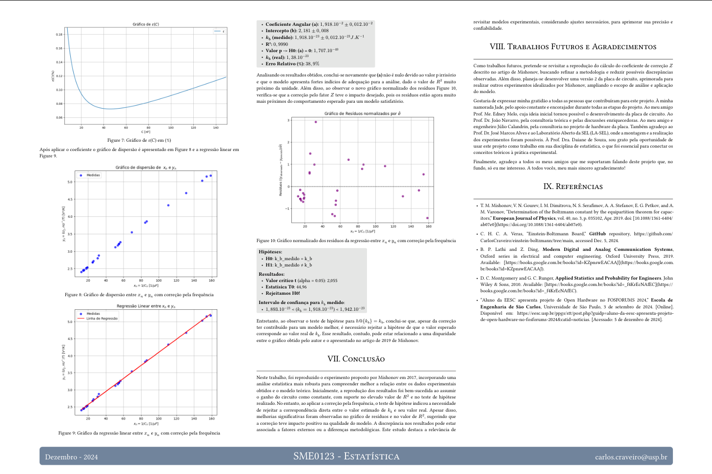

# Apresentação: Determinação da Constante de Boltzmann analisando Ruído Térmico - SME0123 - Estatística

Essa apresentação foi elaborada como atividade avaliativa para a disciplina SME0123 - Estatística, ministrada no segundo semestre de 2024 pela [Prof. Dra. Daiane de Souza](http://lattes.cnpq.br/0929922667210546).


|**Data**  |**Título**                                                       |
|----------|-----------------------------------------------------------------|
|03/12/2024| Determinação da Constante de Boltzmann analisando Ruído Térmico |
------------------------------------------------------------------------------

## IMPORTANTE

Este trabalho foi uma análise estatística dos resultados obtidos através de experimentos realizados com a placa Einstein-Boltzmann, cujas informações estão disponíveis no seguinte [repositório](https://github.com/CarlosCraveiro/einstein-boltzmann).


## Banner/Poster
Está disponível em [`main.pdf`](https://github.com/CarlosCraveiro/PDSA_Presentation/blob/main/main.pdf).



## Template utilizado

O template utilizado `poster.typ` foi retirado do repositório [typst-poster](https://github.com/pncnmnp/typst-poster/tree/master), com apenas algumas poucas adaptações.

## Compilar a apresentação

Baixe as dependências você mesmo, basicamente o `typst` e um visualizador de pdf.

Ou use `nix` para gerenciar as dependências para você: 
```bash
nix --experimental-features 'nix-command flakes'
nix develop -c $SHELL
```

Então, só compilar com:
```bash
typst compile main.typ
```

Agora você deve ter um `main.pdf` para olhar!

## Executar o Jupyter Notebook
Os dados e o script usados para gerar os gráficos e tabelas estão na pasta `scripts/`.

Por padrão, o **Jupyter**, assim como o PDF, deve abrir automaticamente ao executar `nix develop -c $SHELL`, mas se isso não acontecer por algum motivo, basta executar:

```bash
jupyter notebook&

# Se você estiver no Linux:
xdg-open http://127.0.0.1:8888/notebooks/scripts/main.ipynb
# Caso contrário, abra o link acima no navegador de sua preferência.
```

Para mais detalhes sobre as dependências de software (que incluem dependências do Python) deste projeto, consulte o arquivo `shell.nix`.

## Autores

| Estudante                             |  Nº USP  |
|---------------------------------------|--------- |
| Carlos Henrique Craveiro Aquino Veras | 12547187 |

## Licensa
Este trabalho está sob a licensa **Creative Commons Attribution-ShareAlike 4.0 International**, o que inclui as imagens indicadas como autorais.
