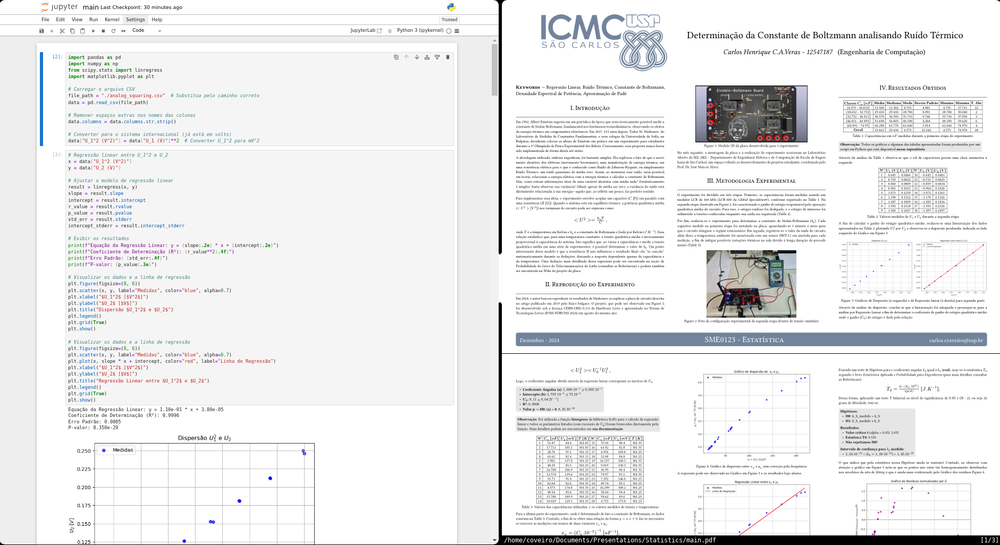

# Presentation: Determination of the Boltzmann Constant by analyzing Thermal Noise - SME0123 - Statistics

This presentation was prepared as an evaluative activity for the course SME0123 - Statistics, taught in the second semester of 2024 by [Prof. Dr. Daiane de Souza](http://lattes.cnpq.br/0929922667210546).




|**Date**  |**Title**                                                           |
|----------|--------------------------------------------------------------------|
|03/12/2024| Determination of the Boltzmann Constant by analyzing Thermal Noise |

## IMPORTANT

I apologize, as until now **I did not have time to translate** the **presentation** and **scripts** **into English**. Additionally, for Portuguese speakers we have the [README-br](https://github.com/CarlosCraveiro/einstein-boltzmann-statistics/blob/main/README-br.md) in Brazilian Portuguese.

---------------------------------------------------------------------------------

## Banner/Poster
Available at [`main.pdf`](https://github.com/CarlosCraveiro/einstein-boltzmann-statistics/blob/main/main.pdf).

## Template Used

The template used, `poster.typ`, was sourced from the repository [typst-poster](https://github.com/pncnmnp/typst-poster/tree/master), with only minor adaptations.

## Compile the Presentation

Download the dependencies yourself, which primarily include `typst` and a PDF viewer.

Or use `nix` to manage the dependencies for you:
```bash
nix --experimental-features 'nix-command flakes'
nix develop -c $SHELL
```
Then, compile with:
```bash
typst compile main.typ
```
You should now have a `main.pdf` to take a look!

## Run Jupyter Notebook
The data and the script used to generate the graphs and tables are in the `scripts/ folder`.

By default, **Jupyter**, as well as the PDF, should open by default when running `nix develop -c $SHELL`, but if this does not happen for some reason. Just run:
```bash
jupyter notebook&

# If you are on Linux:
xdg-open http://127.0.0.1:8888/notebooks/scripts/main.ipynb
# Otherwise, just open the link above in your preferred browser
```
## Authors

| Student                               |  USP ID  |
|---------------------------------------|--------- |
| Carlos Henrique Craveiro Aquino Veras | 12547187 |

## License
This work is licensed under the **Creative Commons Attribution-ShareAlike 4.0 International**, including images indicated as authored.
